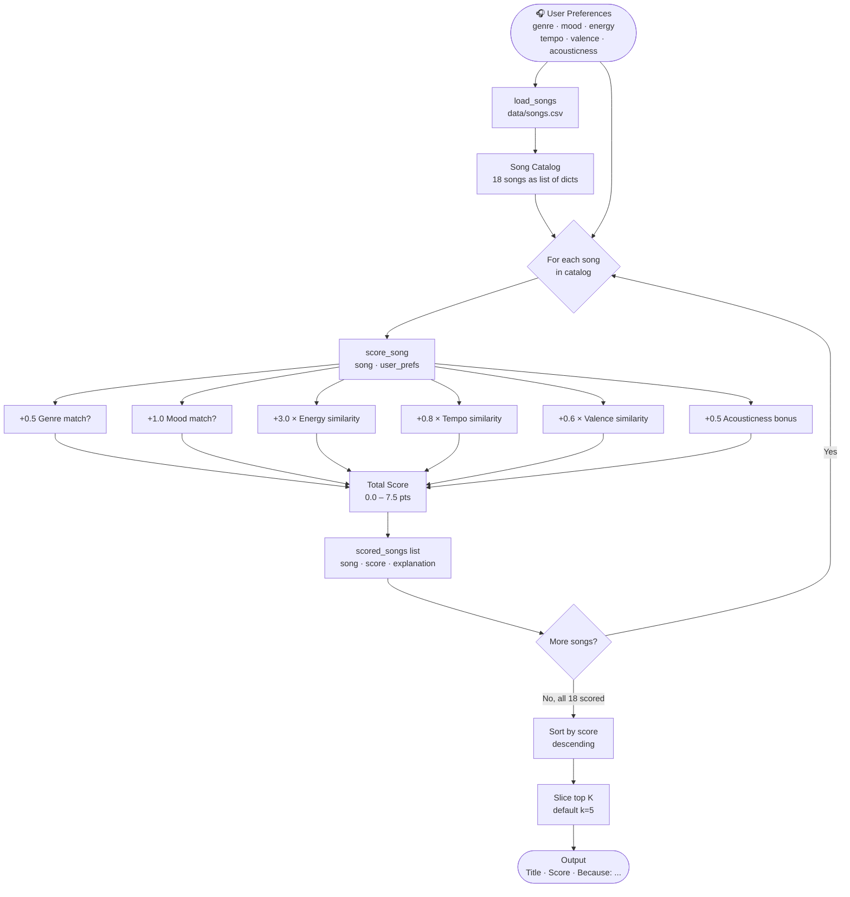
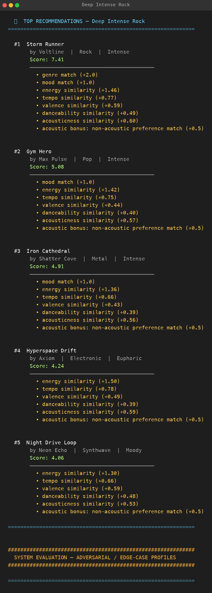
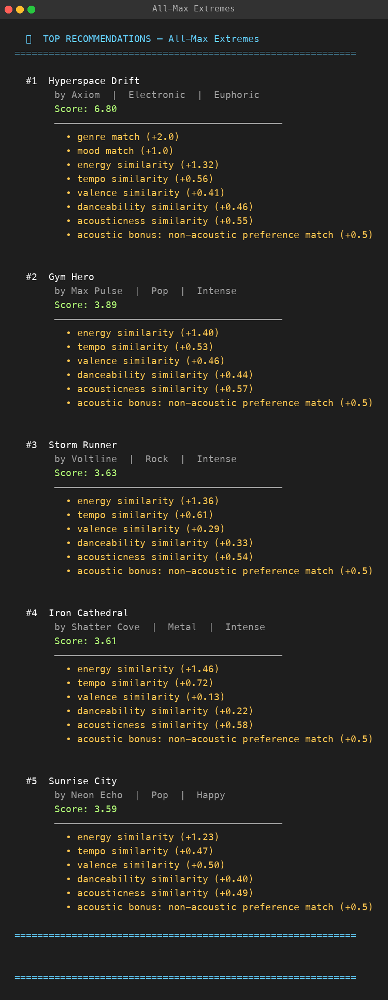

# 🎵 Music Recommender Simulation

## Project Summary

In this project you will build and explain a small music recommender system.

Your goal is to:

- Represent songs and a user "taste profile" as data
- Design a scoring rule that turns that data into recommendations
- Evaluate what your system gets right and wrong
- Reflect on how this mirrors real world AI recommenders

This system loads a catalog of 18 songs from `data/songs.csv`, scores every song against a user taste profile, and returns the top-k highest-scoring songs with an explanation for each recommendation.

---

## How The System Works

This is a purely content-based recommender. There is no play history, no user-to-user comparison, and no learning over time. Every song in the catalog is scored independently against the user's stated preferences, then the list is sorted and the top results are returned.

**Data flow:**



---

### Algorithm Recipe (Finalized)

Scoring happens in three layers:

**Layer 1 — Categorical matches (binary: 1 if match, 0 if not)**

| Rule | Points | Rationale |
|------|--------|-----------|
| `song.genre == user.favorite_genre` | **+0.5** | Genre is a light bonus — continuous features (especially energy) carry more weight in practice |
| `song.mood == user.favorite_mood` | **+1.0** | Mood matters but is secondary; a chill song in the wrong genre still fits mood |

**Layer 2 — Continuous similarity (proximity formula applied per feature)**

For each numeric feature: `similarity = 1.0 - abs(song_value - target_value)`

| Feature | Max Weight | Notes |
|---------|------------|-------|
| `energy` | **× 3.0** | Most immediately felt — a workout user notices a 0.3-energy lofi track instantly; highest weight of any feature |
| `tempo_bpm` (normalized ÷ 200) | **× 0.8** | Normalize raw BPM to 0–1 before differencing; listeners tolerate ±20 BPM easily |
| `valence` | **× 0.6** | Emotional positivity/negativity — important but subjective |
| `danceability` | **× 0.5** | Nice-to-have alignment |
| `acousticness` | **× 0.6** | Strongly felt (electric vs. acoustic) but partly captured by genre already |

**Layer 3 — Acoustic preference bonus (conditional)**

```
if user.likes_acoustic == False and song.acousticness < 0.3:  +0.5
if user.likes_acoustic == True  and song.acousticness > 0.7:  +0.5
```

**Maximum possible score: ~7.5 points**

Full formula:

```
score = (genre_match × 0.5)
      + (mood_match  × 1.0)
      + (1 - |energy      - target_energy|)      × 3.0
      + (1 - |tempo_bpm/200 - target_tempo/200|) × 0.8
      + (1 - |valence     - target_valence|)     × 0.6
      + (1 - |danceability - target_danceability|) × 0.5
      + (1 - |acousticness - target_acousticness|) × 0.6
      + acoustic_bonus (0 or 0.5)
```

### Ranking Rule

```python
recommendations = sorted(scored_songs, key=lambda x: x[1], reverse=True)[:k]
```

Scoring and ranking are kept separate so diversity rules (e.g., cap 1 song per artist) can be added to the ranking step without touching the scoring logic.

---

### Known Biases and Limitations

- **Energy dominance:** With a ×3.0 weight on energy similarity, a song that closely matches the user's target energy will often outscore songs in the user's preferred genre. A user with niche genre preferences may get a narrow, repetitive list skewed toward energy matches rather than genre matches.
- **Mood is all-or-nothing:** "Relaxed" and "chill" feel similar to a human but score 0 against each other because matching is exact string equality. Any mood mismatch loses the full 1.0 point.
- **Small catalog amplifies genre gaps:** With only 18 songs, genres with 1–2 representatives (reggae, metal, country) can only ever surface those songs for matching users, offering no variety.
- **No novelty or diversity:** The algorithm always returns the closest matches. A user who loves rock will always see the same top rock songs — there is no mechanism to surface a surprising but fitting pick from another genre.
- **Static user profile:** Preferences are fixed at run time. Real listeners shift between moods throughout the day; this system has no way to reflect that.

---

## Getting Started

### Setup

1. Create a virtual environment (optional but recommended):

   ```bash
   python -m venv .venv
   source .venv/bin/activate      # Mac or Linux
   .venv\Scripts\activate         # Windows

2. Install dependencies

```bash
pip install -r requirements.txt
```

3. Run the app:

```bash
python -m src.main
```

---

## Profile Output Screenshots

### Standard Taste Profiles

**High-Energy Pop** — upbeat pop fan, high danceability, bright valence


---

**Chill Lofi** — study/focus listener, warm acoustics, slow tempo


---

**Deep Intense Rock** — electric rock/metal fan, high energy, fast tempo



---

### System Evaluation — Adversarial / Edge-Case Profiles

**Conflicting Energy + Sad Mood** — `energy: 0.9` but `mood: sad` (absent from catalog); reveals continuous energy score overrides the 0-point mood miss


---

**All-Max Extremes** — every target at its ceiling (1.0 / 200 BPM); the single genre+mood match creates a large score cliff — #1 scores 6.80, #2 only 3.89



---

**All-Min Zeros** — every target at zero; confirms no negative scores are produced; ambient/low-energy songs rise to the top


---

**Genre Mismatch, Strong Continuous** — classical genre (1 song) + romantic mood (1 r&b song); shows the +2.0 categorical bonus can override a better continuous-feature fit


---

**Acoustic Flag Contradiction** — `likes_acoustic: True` but `target_acousticness: 0.05`; Layer 2 and Layer 3 pull in opposite directions — Storm Runner wins with no acoustic bonus, exposing the silent contradiction


### Running Tests

Run the starter tests with:

```bash
pytest
```

You can add more tests in `tests/test_recommender.py`.

---

## Experiments You Tried

Use this section to document the experiments you ran. For example:

- What happened when you changed the weight on genre from 2.0 to 0.5
- What happened when you added tempo or valence to the score
- How did your system behave for different types of users

---

## Limitations and Risks

Summarize some limitations of your recommender.

Examples:

- It only works on a tiny catalog
- It does not understand lyrics or language
- It might over favor one genre or mood

You will go deeper on this in your model card.

---

## Reflection

[**Model Card**](model_card.md)

**Biggest learning moment**

My biggest learning moment was running the adversarial profiles. I expected the system to break in obvious ways, but instead it broke in subtle ones. *Gym Hero* kept appearing near the top for a "happy pop" listener — not because the code was wrong, but because the energy weight was so high that energy similarity drowned out the genre label. The system was doing exactly what I told it to do. The bias was mine, not a bug. That realization changed how I think about AI systems in general: the model isn't wrong, the design is.

**Using AI tools**

AI tools helped me most when I was stuck on how to phrase scoring logic in plain language and when I needed to think through adversarial test cases I hadn't considered. But I had to double-check outputs whenever the AI described what the code "would do" — sometimes it described the README's intended algorithm rather than what was actually implemented in `recommender.py`. The two didn't always match. I learned to verify by reading the actual code, not just accepting the explanation.

**How a simple algorithm can still "feel" like a recommendation**

What surprised me most is how convincing the output looks even though the algorithm is just arithmetic. When *Library Rain* appears at #1 for a chill lofi listener, it genuinely feels correct — quiet, slow, acoustic, exactly right. The system has no taste, no understanding of music, and no awareness that songs even exist. It just subtracted numbers and sorted them. The "recommendation" feeling comes from the data being well-labeled, not from the algorithm being smart. That gap between looking intelligent and being intelligent was eye-opening.

**What I'd try next**

If I extended this project, I'd add a diversity rule so the top 5 results can't all cluster in the same genre. I'd also try weighting features differently per user type — a genre-first listener should weight genre much higher than someone who mostly cares about energy. Finally, I'd expand the catalog to at least 100 songs, because 18 songs means edge-case profiles run out of good matches almost immediately.


