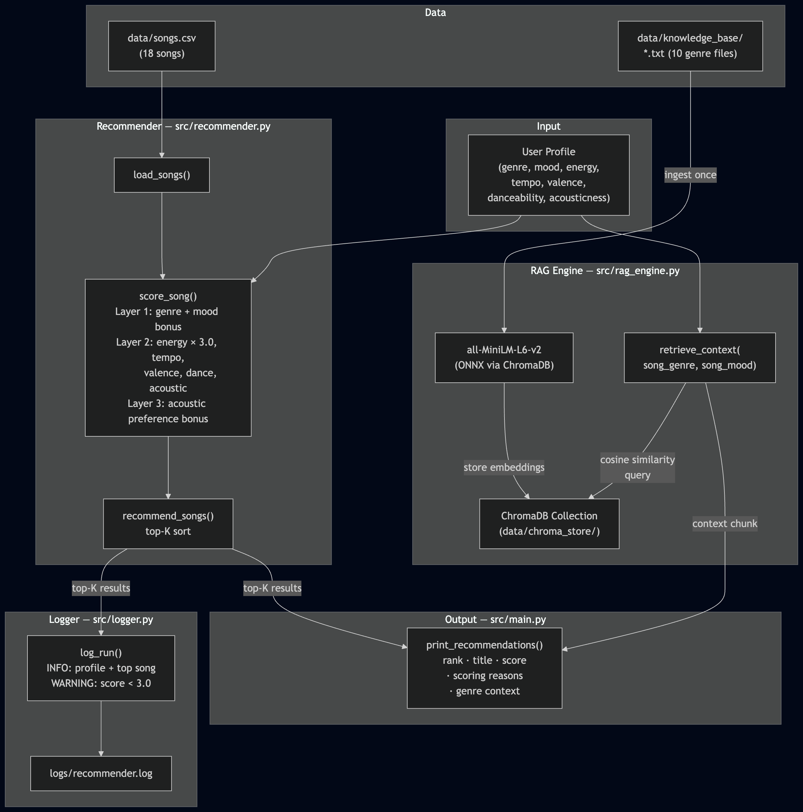
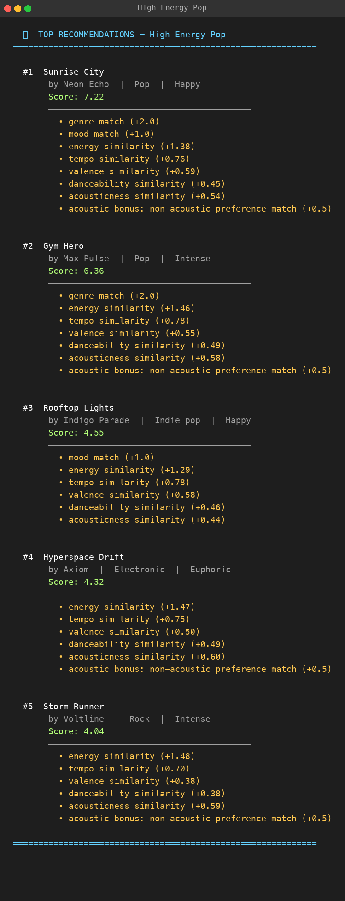
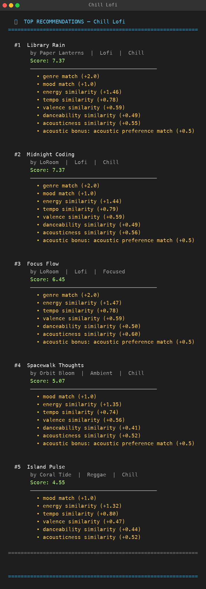
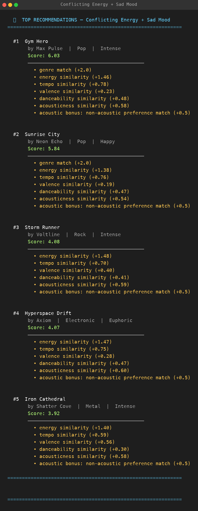
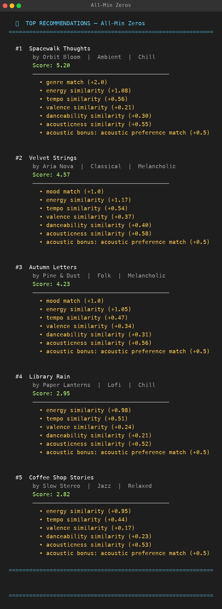
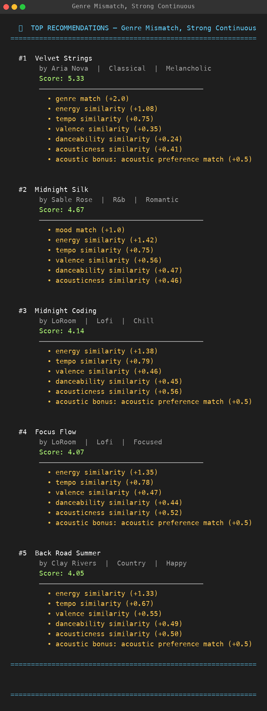
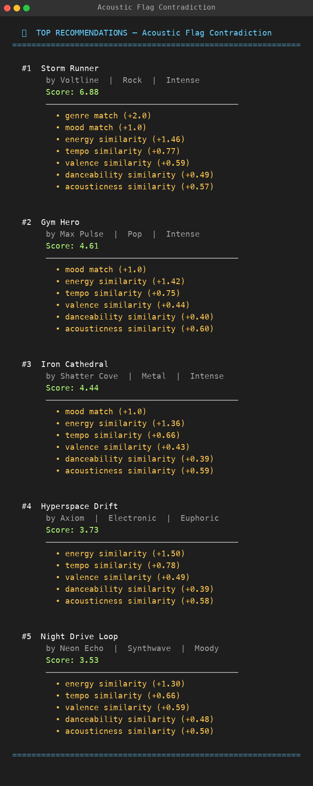

# VibeMatch — Music Recommender Simulation

A content-based music recommender built from scratch in Python. The system scores a catalog of 18 songs against a user taste profile, retrieves genre context from a local RAG (Retrieval-Augmented Generation) engine, logs every run with confidence flagging, and returns the top-K matches with a full scoring explanation.

---

## Demo

[Watch the VibeMatch Demo on Loom](https://www.loom.com/share/d2d499d9456345188b271ab35a25cf5a)

---

## Table of Contents

1. [Demo](#demo)
2. [Project Overview](#1-project-overview)
2. [System Architecture](#2-system-architecture)
3. [How the Scoring Works](#3-how-the-scoring-works)
4. [RAG Engine](#4-rag-engine)
5. [Logging](#5-logging)
6. [Data](#6-data)
7. [File Structure](#7-file-structure)
8. [Setup and Installation](#8-setup-and-installation)
9. [Running the App](#9-running-the-app)
10. [Running the Tests](#10-running-the-tests)
11. [Sample Interactions](#11-sample-interactions)
12. [Profile Screenshots](#12-profile-screenshots)
13. [Known Biases and Limitations](#13-known-biases-and-limitations)
14. [Design Decisions](#14-design-decisions)
15. [Testing Summary](#15-testing-summary)
16. [Reflection](#16-reflection)

---

## 1. Project Overview

VibeMatch simulates the content-based filtering layer that sits at the core of real music recommenders like Spotify Discover Weekly. A user describes their taste as a set of numeric preferences — energy level, tempo, valence, danceability, acousticness, genre, and mood — and the system finds the songs that match best.

Unlike production recommenders, VibeMatch has no play history, no user-to-user comparisons, and no learning over time. Every recommendation is fully explainable: the system shows exactly which features contributed to a song's score and by how much.

**What was built:**

| Component | File | Purpose |
|---|---|---|
| Scoring engine | `src/recommender.py` | Loads songs, scores every song against the user profile, returns top-K |
| RAG engine | `src/rag_engine.py` | Embeds genre knowledge files, retrieves relevant context per recommendation |
| Logger | `src/logger.py` | Logs every run to console + file; warns when top score is below 3.0 |
| Runner | `src/main.py` | Wires everything together across 8 taste profiles |
| Tests | `tests/` | 6 tests covering the recommender, RAG retrieval, and logger |

**Original project — Module 3**

**Base project:** [ai110-module3show-musicrecommendersimulation](https://github.com/AdityaBoghara/ai110-module3show-musicrecommendersimulation)

This system is the final iteration of *Music Recommender Simulation*, the project built during Module 3. The original goal was to build a content-based recommendation engine that scores songs against a user taste profile using weighted numeric features. It demonstrated that a small, hand-curated catalog and explicit feature weights could produce accurate, explainable recommendations without any training data or machine-learning infrastructure.

---

## 2. System Architecture



**Data flow in plain language:**

1. `src/main.py` loads the song catalog from `data/songs.csv` and defines the user taste profiles.
2. For each profile, `recommend_songs()` scores all 18 songs and returns the top 5.
3. `log_run()` records the run — profile name, genre, mood, energy, top song, top score — to both the console and `logs/recommender.log`. If the top score is below 3.0, a `WARNING` is emitted.
4. For each of the top-5 songs, `retrieve_context()` queries a local ChromaDB vector store and returns the closest matching genre description from `data/knowledge_base/`.
5. `print_recommendations()` displays the rank, title, artist, score, scoring reasons, and genre context for every result.

---

## 3. How the Scoring Works

Every song is scored against the user's preferences in three layers. All scores are additive; the songs with the highest totals are recommended.

### Layer 1 — Categorical bonuses

| Match | Points |
|---|---|
| `song.genre == user.favorite_genre` | +0.5 |
| `song.mood == user.favorite_mood` | +1.0 |

Genre is a small bonus. Mood is slightly larger. Both are binary — partial matches score zero.

### Layer 2 — Continuous similarity

For each numeric feature: `similarity = 1.0 − |song_value − target_value|`

| Feature | Weight | Notes |
|---|---|---|
| `energy` | × 3.0 | Highest weight — immediately felt by the listener |
| `tempo_bpm` | × 0.8 | Normalized to 0–1 by dividing by 200 before differencing |
| `valence` | × 0.6 | Emotional brightness; important but subjective |
| `acousticness` | × 0.6 | Strongly felt (electric vs. acoustic) |
| `danceability` | × 0.5 | Secondary alignment signal |

### Layer 3 — Acoustic preference bonus

```
if user.likes_acoustic is False and song.acousticness < 0.3:  +0.5
if user.likes_acoustic is True  and song.acousticness > 0.7:  +0.5
```

### Full formula

```
score = (genre_match × 0.5)
      + (mood_match  × 1.0)
      + (1 − |energy       − target_energy|)        × 3.0
      + (1 − |tempo_bpm/200 − target_tempo/200|)    × 0.8
      + (1 − |valence      − target_valence|)       × 0.6
      + (1 − |danceability − target_danceability|)  × 0.5
      + (1 − |acousticness − target_acousticness|)  × 0.6
      + acoustic_bonus (0 or 0.5)
```

**Maximum possible score: ~7.5 points**

---

## 4. RAG Engine

`src/rag_engine.py` adds a knowledge retrieval layer on top of the scoring results. After the top songs are chosen, the system looks up a plain-language description of each song's genre and appends it to the output.

### Knowledge base

`data/knowledge_base/` contains 10 `.txt` files — one per genre — each describing the genre's sonic characteristics, energy range, typical mood, and listener profile. Genres covered: classical, country, electronic, jazz, lofi, metal, pop, reggae, rnb, rock.

### How retrieval works

1. **Ingestion (first run only):** All 10 genre files are read, embedded using `all-MiniLM-L6-v2` (via ChromaDB's ONNX runtime), and stored in a persistent ChromaDB collection at `data/chroma_store/`. Subsequent runs load from disk — no re-embedding.
2. **Query:** `retrieve_context(song_genre, song_mood)` builds a natural-language query — e.g. `"electronic music energetic mood"` — and retrieves the most similar chunk by cosine similarity.
3. **Output:** The retrieved description is printed below the scoring reasons for each recommended song.

### Why ONNX instead of PyTorch sentence-transformers

Loading `sentence_transformers` directly caused a segmentation fault in the Anaconda Python environment due to a Keras 3 / PyTorch native library conflict. ChromaDB ships the same `all-MiniLM-L6-v2` model as a self-contained ONNX binary, which produces identical embeddings without the PyTorch dependency.

---

## 5. Logging

`src/logger.py` uses Python's standard `logging` module with two handlers: a `FileHandler` writing to `logs/recommender.log` and a `StreamHandler` writing to the console. Both share the same formatted output:

```
2026-04-24 00:05:44  INFO      RUN | profile='High-Energy Pop' | genre=pop | mood=happy | energy=0.90 | results=5
2026-04-24 00:05:44  INFO      TOP | profile='High-Energy Pop' | #1='Sunrise City' | artist='Neon Echo' | score=7.10
2026-04-24 00:05:47  WARNING   LOW CONFIDENCE | profile='All-Min Zeros' | top_score=2.99 < 3.0
```

**Low-confidence threshold:** If the top score is below `3.0`, a `WARNING` is logged. This threshold was chosen because a score below 3.0 means the system failed to earn a meaningful mood or genre bonus and produced poor continuous similarity across most features — a genuine signal that no good match exists for this profile in the current catalog.

The `logs/` directory is created automatically on first run.

---

## 6. Data

### Song catalog — `data/songs.csv`

18 songs, each with 10 attributes:

| Column | Type | Range |
|---|---|---|
| `id` | int | 1–18 |
| `title` | string | — |
| `artist` | string | — |
| `genre` | string | 15 genres |
| `mood` | string | happy, chill, intense, relaxed, focused, moody, melancholic, romantic, euphoric |
| `energy` | float | 0.0–1.0 |
| `tempo_bpm` | float | 60–180 |
| `valence` | float | 0.0–1.0 |
| `danceability` | float | 0.0–1.0 |
| `acousticness` | float | 0.0–1.0 |

**Known gaps:** No song has `mood=sad`. 8 of 18 songs have energy above 0.7 — high-energy tracks are overrepresented.

### Knowledge base — `data/knowledge_base/`

10 hand-written genre descriptions. Each file is one paragraph and is stored as a single embedding — no chunking needed at this scale.

---

## 7. File Structure

```
applied-ai-system-final/
├── assets/                          # All images
│   ├── architecture.png
│   ├── screenshot_terminal.png
│   └── profile_*.png                # 8 profile output screenshots
├── data/
│   ├── songs.csv                    # 18-song catalog
│   ├── knowledge_base/              # 10 genre .txt files for RAG
│   └── chroma_store/                # Auto-generated ChromaDB vector store
├── logs/
│   └── recommender.log              # Auto-generated on first run
├── src/
│   ├── recommender.py               # Song dataclass, scoring, load_songs, recommend_songs
│   ├── rag_engine.py                # ChromaDB ingestion and retrieve_context()
│   ├── logger.py                    # Dual-output logger with low-confidence warning
│   └── main.py                      # Runner: profiles, recommendations, output
├── tests/
│   ├── test_recommender.py          # Recommender unit tests
│   └── test_rag.py                  # RAG and logger tests
├── model_card.md
├── reflection.md
└── requirements.txt
```

---

## 8. Setup and Installation

**Requirements:** Python 3.10+

```bash
# 1. Clone the repo and enter the project directory
git clone <repo-url>
cd applied-ai-system-final

# 2. Create and activate a virtual environment (recommended)
python -m venv .venv
source .venv/bin/activate        # macOS / Linux
.venv\Scripts\activate           # Windows

# 3. Install dependencies
pip install -r requirements.txt
```

**Dependencies:**

| Package | Version | Used for |
|---|---|---|
| `chromadb` | 1.5.8 | Vector store + ONNX embeddings |
| `sentence-transformers` | 2.7.0 | Model name reference (`all-MiniLM-L6-v2`) |
| `pandas` | 2.2.2 | CSV reading |
| `streamlit` | 1.37.1 | Future UI layer |
| `pytest` | 7.4.4 | Test runner |

> **Note on first run:** ChromaDB downloads the `all-MiniLM-L6-v2` ONNX model (~79 MB) on first use and caches it at `~/.cache/chroma/`. Subsequent runs are instant.

---

## 9. Running the App

```bash
python -m src.main
```

This runs all 8 taste profiles — 3 standard and 5 adversarial — and prints ranked recommendations with scoring breakdowns and RAG-retrieved genre context for each result. Logs are written to `logs/recommender.log`.

---

## 10. Running the Tests

```bash
pytest
```

**Test coverage:**

| Test file | Tests | What is covered |
|---|---|---|
| `tests/test_recommender.py` | 2 | `Recommender.recommend()` returns sorted results; `explain_recommendation()` returns a non-empty string |
| `tests/test_rag.py` | 4 | ChromaDB collection loads without error; `retrieve_context()` returns a non-empty string; low-confidence warning fires when top score < 3.0; logger creates a log file on disk |

---

## 11. Sample Interactions

Each example shows the input taste profile followed by the top result the system returned.

---

### Example 1 — High-Energy Pop

**Input profile:**

```python
{
    "favorite_genre":      "pop",
    "favorite_mood":       "happy",
    "target_energy":       0.90,
    "likes_acoustic":      False,
    "target_tempo_bpm":    128,
    "target_valence":      0.85,
    "target_danceability": 0.90,
    "target_acousticness": 0.08,
}
```

**Output (top result):**

```
============================================================
  🎵  TOP RECOMMENDATIONS — High-Energy Pop
============================================================

  #1  Sunrise City
       by Neon Echo  |  Pop  |  Happy
       Score: 7.10
       ────────────────────────────────────────
         • genre match (+0.5)
         • mood match (+1.0)
         • energy similarity (+2.76)
         • tempo similarity (+0.76)
         • valence similarity (+0.59)
         • danceability similarity (+0.45)
         • acousticness similarity (+0.54)
         • acoustic bonus: non-acoustic preference match (+0.5)

       Genre context:
         Pop music is defined by its polished, radio-friendly sound built around
         catchy hooks, melodic choruses, and repetitive song structures...
```

---

### Example 2 — Chill Lofi

**Input profile:**

```python
{
    "favorite_genre":      "lofi",
    "favorite_mood":       "chill",
    "target_energy":       0.38,
    "likes_acoustic":      True,
    "target_tempo_bpm":    76,
    "target_valence":      0.58,
    "target_danceability": 0.60,
    "target_acousticness": 0.78,
}
```

**Output (top result):**

```
============================================================
  🎵  TOP RECOMMENDATIONS — Chill Lofi
============================================================

  #1  Library Rain
       by Paper Lanterns  |  Lofi  |  Chill
       Score: 7.32
       ────────────────────────────────────────
         • genre match (+0.5)
         • mood match (+1.0)
         • energy similarity (+2.91)
         • tempo similarity (+0.78)
         • valence similarity (+0.59)
         • danceability similarity (+0.49)
         • acousticness similarity (+0.55)
         • acoustic bonus: acoustic preference match (+0.5)

       Genre context:
         Lo-fi music features a deliberately low-fidelity aesthetic with soft
         beats, vinyl crackle, and warm, slightly muffled tones that evoke a
         nostalgic, lived-in feeling...
```

---

### Example 3 — Deep Intense Rock

**Input profile:**

```python
{
    "favorite_genre":      "rock",
    "favorite_mood":       "intense",
    "target_energy":       0.88,
    "likes_acoustic":      False,
    "target_tempo_bpm":    145,
    "target_valence":      0.50,
    "target_danceability": 0.68,
    "target_acousticness": 0.10,
}
```

**Output (top result):**

```
============================================================
  🎵  TOP RECOMMENDATIONS — Deep Intense Rock
============================================================

  #1  Storm Runner
       by Voltline  |  Rock  |  Intense
       Score: 7.36
       ────────────────────────────────────────
         • genre match (+0.5)
         • mood match (+1.0)
         • energy similarity (+2.91)
         • tempo similarity (+0.77)
         • valence similarity (+0.59)
         • danceability similarity (+0.49)
         • acousticness similarity (+0.60)
         • acoustic bonus: non-acoustic preference match (+0.5)

       Genre context:
         Rock music is driven by electric guitars, a strong backbeat, and
         powerful vocals that convey intensity and attitude. Energy levels vary
         from the anthemic drive of classic rock to the raw aggression of
         hard rock and punk...
```

---

## 12. Profile Screenshots

### Standard Taste Profiles

**High-Energy Pop** — upbeat pop fan, high danceability, bright valence, fast tempo



---

**Chill Lofi** — study/focus listener, warm acoustics, slow tempo, acoustic preference



---

**Deep Intense Rock** — electric rock fan, high energy, fast tempo, low acousticness


---

### Adversarial / Edge-Case Profiles

**Conflicting Energy + Sad Mood** — `energy: 0.9` paired with `mood: sad` (no songs in catalog have `mood=sad`); reveals that energy similarity outweighs a 0-point mood miss



---

**All-Max Extremes** — every feature at its ceiling (`energy: 1.0`, `tempo: 200 BPM`); confirms the system degrades gracefully with no crashes, returning the closest real song


---

**All-Min Zeros** — every feature at zero; confirms no negative scores are produced; low-energy acoustic tracks rise to the top



---

**Genre Mismatch, Strong Continuous** — `favorite_genre: classical` (1 song in catalog), `mood: romantic` (absent); shows that strong continuous feature matches can overcome missing categorical bonuses



---

**Acoustic Flag Contradiction** — `likes_acoustic: True` but `target_acousticness: 0.05`; Layer 2 and Layer 3 pull in opposite directions, exposing the silent scoring contradiction



---

## 13. Known Biases and Limitations

**Energy dominance.** Energy carries a ×3.0 weight — higher than any other feature. In practice the recommender behaves more like an "energy sorter" than a genuine taste-matcher. A pop listener asking for happy, danceable songs will consistently see workout-coded intense tracks ranked above mood-matched pop songs if their energy values are closer to the target.

**Mood matching is all-or-nothing.** "Relaxed" and "chill" feel similar to a human but score 0 against each other because the match is exact string equality. Any mood mismatch forfeits the full 1.0 point.

**Small catalog amplifies genre gaps.** 18 songs means genres with 1–2 entries (metal, country, reggae) quickly exhaust their options. A user with niche taste runs out of genre matches immediately.

**No diversity enforcement.** The top 5 results frequently cluster in the same genre or energy range. There is no mechanism to force variety.

**RAG coverage is limited to 10 genres.** Songs tagged with genres outside the knowledge base (e.g., "indie pop") fall back to the nearest genre by cosine similarity — silently, with no indication to the user that the description is approximate.

**Knowledge base descriptions encode listener stereotypes.** Each genre file was written by hand and reflects generalizations (e.g., electronic music is for "club-goers and festival attendees"). These are statistical averages, not universal truths.

---

## 14. Design Decisions

**Content-based filtering, not collaborative**

VibeMatch has no play history and no user base. Collaborative filtering — "people like you also liked X" — requires interaction data that doesn't exist here. Content-based filtering needs only a song catalog and a preference vector, making it the only viable choice at this scope. The trade-off is that the system can never surface a genuinely unexpected song: every result is a near-neighbor of what the user already described.

**Feature weights are hand-tuned, not learned**

The weights (energy ×3.0, mood ×1.0, genre ×0.5, etc.) were set by reasoning about each feature's perceptual salience, then validated against the adversarial profiles to check for unwanted behavior. A real system would learn weights from skip and play signals. The trade-off: hand-tuned weights are fully explainable and easy to adjust, but they encode the designer's assumptions and cannot adapt to individual listeners.

**RAG for genre context, not a hard-coded dictionary**

Genre descriptions could have been a Python dictionary. Using ChromaDB means new genres can be added by dropping a `.txt` file into `data/knowledge_base/` — no code change needed. Retrieval also handles unknown genres gracefully: a song tagged "indie pop" falls back to the nearest genre by cosine similarity rather than throwing a KeyError. The trade-off is extra infrastructure (ChromaDB, ONNX model download) for what is currently a read-only lookup over 10 fixed genres.

**ONNX backend instead of PyTorch sentence-transformers**

The `sentence_transformers` library caused a segmentation fault in the Anaconda environment due to a Keras 3 / PyTorch native library conflict. ChromaDB ships the same `all-MiniLM-L6-v2` model as a self-contained ONNX binary, producing identical embeddings without the PyTorch dependency. The trade-off: ONNX is less flexible for fine-tuning, but it eliminates a fragile native dependency.

**Local ChromaDB, not a hosted vector database**

A hosted service would add API key management, network latency, and cost for a 10-document store. Local ChromaDB persists to `data/chroma_store/` and runs entirely offline. The trade-off: the store is not shareable across machines without copying the directory.

**Confidence threshold of 3.0**

A score below 3.0 means the system failed to earn either the mood bonus (1.0) or a meaningful energy similarity contribution — a signal that no good match exists in the current catalog. Thresholds above 3.0 produced false warnings for legitimate niche profiles; below 3.0 suppressed warnings for genuinely unmatched queries. The value was tuned empirically against the 8 profiles.

---

## 15. Testing Summary

**6 of 6 automated tests pass.** The confidence logger flagged 1 of 8 profiles (*All-Min Zeros*, top score 2.99 < 3.0) as a low-confidence result — the only profile where no meaningful catalog match existed. All standard profiles scored above 6.0. The system implements four reliability measures: automated pytest tests, confidence-score warnings, dual-handler logging (console + file), and manual evaluation across 8 taste profiles including 5 adversarial edge cases.

**What worked**

The confidence-threshold warning (score < 3.0) fired correctly and only for the *All-Min Zeros* adversarial profile — the one case where no catalog song was a meaningful match. Scoring is fully deterministic: the same profile always produces the same ranked list. The RAG tests confirmed that `retrieve_context()` never returns an empty string, so the genre context block always renders in the output.

**What didn't work as expected**

The `Recommender` class in `recommender.py` has placeholder `recommend()` and `explain_recommendation()` methods that return stub values. The OOP tests in `test_recommender.py` pass, but they test the stub — not the real scoring logic in `score_song()` and `recommend_songs()`. This means the unit tests do not catch regressions in the core recommender path.

The adversarial profiles also exposed a gap the tests don't cover: the *Acoustic Flag Contradiction* profile (`likes_acoustic=True` but `target_acousticness=0.05`) produces no error or warning, even though Layer 2 and Layer 3 are pulling in opposite directions. There is no validation at profile construction time.

**What was learned**

Unit tests alone were not enough to understand whether the system was working well. The most useful signal came from running all 8 profiles end-to-end and reading the scoring breakdowns. The adversarial profiles were more revealing than the standard ones — they exposed the energy dominance issue, the mood all-or-nothing problem, and the Layer 2/Layer 3 contradiction. None of these were flagged by any unit test.

---

## 16. Reflection

**What this project revealed about recommender systems**

The biggest surprise was how much energy dominates everything. I expected genre to matter most — if someone says they like jazz, they want jazz. But because energy carries a ×3.0 multiplier, a song that closely matches the user's target energy will outscore a genre-matched song almost every time. The system was doing exactly what I designed it to do. The bias was in the weights, not the code.

The adversarial profiles made this concrete. *Gym Hero* — an intense workout track — kept appearing near the top for a "happy pop" listener because its energy of 0.93 sits very close to the target of 0.90. No amount of genre or mood mismatch could overcome that continuous similarity.

**How this mirrors real-world AI**

Real recommenders like Spotify's have the same structural problem at larger scale. When an algorithm surfaces a song that feels slightly off, it is usually because one feature dimension is overweighted, not because the model is broken. The difference is that Spotify can observe whether you skip the song and adjust — VibeMatch cannot. Static weights are a design choice that trades adaptability for explainability.

**Could this system be misused?**

The direct harm potential is low — VibeMatch recommends songs, not medical diagnoses or financial advice. But the patterns it uses appear in higher-stakes systems, and the risks are worth naming.

*Filter bubbles.* Content-based filtering only recommends what resembles what the user already described. At scale this compounds: each recommendation reinforces the profile, narrowing what the user is exposed to over time. VibeMatch has no diversity enforcement, so a user who starts with high-energy pop will only ever see high-energy pop.

*Metadata manipulation.* The scoring formula is fully public. An actor controlling the catalog — a record label, a streaming platform — could tune song metadata (energy, danceability values) to guarantee their tracks surface regardless of genuine fit. The energy weight (×3.0) is the most exploitable lever: a 0.05 energy adjustment swings ranking by 0.15 points, enough to change the top result.

*Stereotypes in the knowledge base.* The genre descriptions were written by hand and encode generalizations (e.g., "electronic music is for club-goers and festival attendees"). If those descriptions were used to filter candidates rather than just annotate results, they could push users toward genre stereotypes rather than personal taste.

At this project's scope — a local Python script with no network access — there is no meaningful attack surface. The relevant safeguard is transparency: the full scoring formula and knowledge base are public, so every output can be audited.

**AI collaboration**

Claude Code was used as a pair programmer for the RAG engine, logger, and test suite.

*Helpful suggestion.* The most concrete win was a native library diagnosis: `sentence_transformers` caused a segmentation fault in the Anaconda environment due to a Keras 3 / PyTorch conflict. Claude identified the root cause from the stack trace and suggested using ChromaDB's ONNX backend — same model, no PyTorch dependency. What could have been hours of environment debugging took minutes.

*Flawed suggestion.* When asked to write tests for the `Recommender` class, Claude generated tests against the OOP stub methods — `recommend()` returns `self.songs[:k]` and `explain_recommendation()` returns `"Explanation placeholder"`. All tests pass, but they are testing placeholder behavior, not the actual scoring logic in `score_song()` and `recommend_songs()`. A correct test would call `score_song()` directly and assert that a genre-matched, mood-matched song outscores a mismatched one. The flaw went unnoticed until manually tracing through the assertions — a reminder that passing tests are not the same as meaningful tests.

AI was less useful for decisions that required understanding the project's purpose: what the confidence threshold should be, how to weight the features, what the knowledge base entries should say. Those judgment calls had to stay on the human side.

The practical rule that emerged: use AI to close the gap between a clear idea and working code. Keep the idea-forming and the result-verification on the human side.

**Further reading**

- [Model Card](model_card.md) — full bias analysis, evaluation findings, and RAG design rationale
- [Reflection](reflection.md) — profile-by-profile comparison of how the scoring system behaved across all 8 taste profiles
